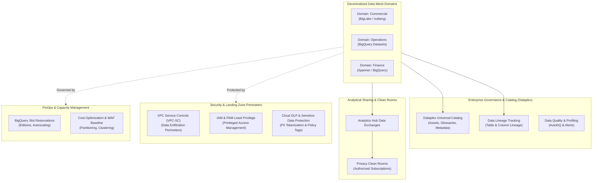

# Role Blueprint: Google Cloud Data Enterprise Architect

This document serves as the architectural reference and companion guide to the [`clusters/gcp-data-enterprise-architect.json`](file:///home/sergiobermudez/local_projects/skills-hub/clusters/gcp-data-enterprise-architect.json) cluster definition.

---

## 1. Role Definition: Google Cloud Data Enterprise Architect

A **Google Cloud Data Enterprise Architect** is a strategic technical authority responsible for designing, governing, securing, and scaling an organization's overall data estate on Google Cloud. 

Unlike a **Data Engineer** (who implements ETL/ELT pipelines and transformation scripts) or a **Data Scientist** (who develops models and exploratory algorithms), the Enterprise Architect operates across macro-topology, cross-domain interoperability, security perimeters, regulatory compliance, and FinOps economics.



### Core Architectural Pillars

1. **Decentralized Data Mesh & Analytical Lakehouse Topology**:
   - Architecting domain-oriented data ownership where business domains publish autonomous, certified **Data Products**.
   - Designing multi-engine storage and open table formats (BigQuery, BigLake, Apache Iceberg, Delta Lake) with GCS lifecycle policies.
   - Establishing inter-domain sharing, data monetization, and clean rooms using **Analytics Hub**.

2. **Enterprise Governance, Metadata & Lineage**:
   - Implementing enterprise metadata discovery, automated cataloging, and unified business glossaries with **Dataplex**.
   - Ensuring end-to-end auditability through universal column- and table-level **Data Lineage** across ingestion, dbt, Spark, and BI.

3. **Google Cloud Well-Architected Framework (WAF)**:
   - Enforcing GCP WAF best practices across **Cost Optimization**, **Reliability & Disaster Recovery** (cross-region replication, dual-region buckets, RPO/RTO), and **Operational Excellence**.

4. **FinOps & Capacity Optimization**:
   - Strategic capacity planning across BigQuery Editions (Standard, Enterprise, Enterprise Plus), slot reservations, and autoscaling.
   - Guardrailing enterprise query costs via partition/cluster enforcement, reservation baseline limits, and materialized views.

5. **Security, Landing Zones & Data Perimeters**:
   - Establishing enterprise landing zones with **Google Cloud Recipe Foundation Builder** and Cloud Foundation Toolkit.
   - Enforcing data perimeters via **VPC Service Controls (VPC-SC)**, least-privilege IAM, Privileged Access Management (PAM), and Cloud DLP.

6. **Data Modernization & Migration Strategy**:
   - Formulating modernization roadmaps, automated SQL/schema translation (e.g., Snowflake, Teradata, Redshift to BigQuery), and dual-run validation pipelines.

---

## 2. Skill Breakdown by Competency

The [`gcp-data-enterprise-architect`](file:///home/sergiobermudez/local_projects/skills-hub/clusters/gcp-data-enterprise-architect.json) cluster bundles **21 skills** and **1 plugin** mapped directly to the core architectural pillars:

| Competency Domain | Skill / Plugin Identifier | Architectural Rationale | Provenance Source |
| :--- | :--- | :--- | :--- |
| **Mesh & Lakehouse Topology** | `google-cloud-solution-agentic-ai-borderless-data-lakehouse` | Blueprint for designing multi-engine lakehouses spanning BigQuery, BigLake, and object storage. | `google-cloud-skills` |
| | `federate-lakehouse-catalog` | Federation of external metastores and catalogs (e.g., Hive, Iceberg REST, Dataplex). | `google-cloud-skills` |
| | `google-cloud-storage-bucket-architect` | Designing resilient Cloud Storage layouts, lifecycle rules, dual-region replication, and storage tiers. | `google-cloud-skills` |
| | `spanner-basics` | Incorporating globally distributed relational operational databases into analytical pipelines. | `google-cloud-skills` |
| **Governance, Catalog & Lineage** | `google-cloud-solution-agentic-analytics-spark-knowledge-catalog` | Dataplex integration with Spark, metadata harvesting, and automated knowledge cataloging. | `google-cloud-skills` |
| | `datalineage-summary` | Inspecting and summarizing end-to-end lineage across datasets and transformations. | `gcp-developer-assist-skills` |
| | `datalineage-bigquery-asset-impact-analysis` | Performing upstream and downstream blast-radius analysis before schema or pipeline migrations. | `gcp-developer-assist-skills` |
| | `discovering-gcp-data-assets` | Automated discovery and inventory of untagged or newly provisioned data assets across projects. | `gcp-developer-assist-skills` |
| **Well-Architected Framework (WAF)** | `google-cloud-solution-architecture` | End-to-end cloud solution design, architecture review standards, and system topologies. | `google-cloud-skills` |
| | `google-cloud-waf-cost-optimization` | Alignment with Google Cloud WAF principles for cost transparency, rightsizing, and FinOps. | `google-cloud-skills` |
| | `google-cloud-waf-security` | Alignment with Google Cloud WAF principles for defense-in-depth, least privilege, and identity. | `google-cloud-skills` |
| | `google-cloud-waf-reliability` | Alignment with Google Cloud WAF principles for high availability, fault tolerance, and DR. | `google-cloud-skills` |
| **FinOps & Capacity Optimization** | `bigquery-optimization` | SQL query tuning, partitioning, clustering, anti-pattern detection, and execution plan profiling. | `google-cloud-skills` |
| | `bigquery-slot-cost-optimizer` | BigQuery Editions slot reservation sizing, autoscaling configuration, and commitments. | `google-cloud-skills` |
| **Security & Landing Zones** | `google-cloud-recipe-foundation-builder` | Enterprise landing zone automation, folder hierarchies, organizational policies, and project factories. | `google-cloud-skills` |
| | `iam-helper-for-policy-management` | Designing least-privilege IAM policies, condition bindings, and service account perimeters. | `gcp-developer-assist-skills` |
| | `iam-helper-for-privileged-access-management` | Enforcing just-in-time (JIT) access and Privileged Access Management (PAM) for production data. | `gcp-developer-assist-skills` |
| | `gcs-security-assessment` | Auditing bucket ACLs, uniform bucket-level access, public access prevention, and CMEK encryption. | `gcp-developer-assist-skills` |
| | `accidental-data-loss-prevention` | Configuring soft delete, object versioning, and retention policies to safeguard against catastrophic loss. | `gcp-developer-assist-skills` |
| **Ingestion & Pipelines** | `gcp-data-pipelines` | Architecture patterns for batch and real-time ingestion, Cloud Composer orchestration, and Pub/Sub. | `data-engineer` |
| | `gcp-dataflow` | Apache Beam / Dataflow stream processing architecture, autoscaling, and exactly-once processing. | `google-cloud-skills` |
| **Modernization & Translation** | `dbt-sf-to-bq-translator` | Automated migration rules, SQL dialect conversion, and dbt models from Snowflake to BigQuery. | `data-engineer` |
| **Plugin** | `googlecloud-data` | Bundled plugin providing ready-to-run rules and data engineering standards for Google Cloud. | `internal/plugins` |

---

## 3. Missing Skills Analysis (Catalog Gaps)

While the existing catalog provides strong coverage across lakehouse storage, query optimization, and foundational security, an Enterprise Architect role requires deeper capabilities in **cross-organization sharing**, **automated data quality**, **data contracts**, and **zero-trust perimeters**.

The following skills are not yet available in the hub catalog and are recommended for creation in `internal/skills/`:

```
┌────────────────────────────────────────────────────────────────────────────────┐
│                       Catalog Gap Scaffolding Roadmap                          │
├────────────────────────────────────────────────────────────────────────────────┤
│ 1. gcp-analytics-hub-data-sharing       → Data sharing, listings & clean rooms │
│ 2. dataplex-data-quality-autodq         → Declarative YAML DQ & scorecards     │
│ 3. cloud-dlp-sensitive-data-protection  → Automated PII discovery & tokenizing │
│ 4. data-mesh-contract-modeling          → OpenDataContract & schema evolution  │
│ 5. vpc-service-controls-data-perimeters → VPC-SC perimeters & domain bridges   │
└────────────────────────────────────────────────────────────────────────────────┘
```

### Gap Details & Blueprint Specifications

#### 1. `gcp-analytics-hub-data-sharing`
- **Architectural Need**: Enterprise Data Mesh topologies require cross-domain and cross-tenant sharing without moving or copying petabytes of data.
- **Key Capabilities**:
  - Designing private and public Analytics Hub Data Exchanges.
  - Configuring curated listings, authorized datasets, and subscriber access entitlements.
  - Architecting BigQuery data clean rooms with differential privacy and aggregated query enforcement.
- **Recommended Implementation**: Scaffold in `internal/skills/gcp-analytics-hub-data-sharing` using Google Cloud Analytics Hub Terraform modules and gcloud/REST templates.

#### 2. `dataplex-data-quality-autodq`
- **Architectural Need**: Enterprise architects must establish automated data quality gates rather than relying on disparate ad-hoc SQL assertions.
- **Key Capabilities**:
  - Authoring declarative YAML data quality rule definitions (completeness, uniqueness, range, regex, custom SQL).
  - Configuring Dataplex AutoDQ continuous profiling jobs and publishing scorecards to the Dataplex catalog.
  - Wiring quality score thresholds to Cloud Monitoring alerts and automated pipeline halts.
- **Recommended Implementation**: Scaffold in `internal/skills/dataplex-data-quality-autodq` with standard Dataplex YAML rule templates and CI/CD validation scripts.

#### 3. `cloud-dlp-sensitive-data-protection`
- **Architectural Need**: Protecting sensitive PII, PHI, and financial data across the lakehouse is mandatory under GDPR, HIPAA, and PCI-DSS.
- **Key Capabilities**:
  - Automated continuous inspection and discovery scans on BigQuery tables and Cloud Storage buckets.
  - Designing de-identification templates: deterministic cryptographic hashing, pseudonymization, and bucketing.
  - Integrating Cloud DLP with BigQuery Policy Tags for dynamic column-level data masking based on IAM caller identity.
- **Recommended Implementation**: Scaffold in `internal/skills/cloud-dlp-sensitive-data-protection` with Cloud DLP inspection templates and Terraform policy tag bindings.

#### 4. `data-mesh-contract-modeling`
- **Architectural Need**: In a decentralized mesh, producer domains must provide guaranteed schema and SLA contracts to downstream consumer domains.
- **Key Capabilities**:
  - Formulating OpenDataContract / JSON Schema specifications describing dataset structure, semantics, and SLA terms.
  - Establishing schema evolution rules (backward, forward, full compatibility) enforced during CI/CD.
  - Defining automated producer-consumer contract verification hooks before merging changes.
- **Recommended Implementation**: Scaffold in `internal/skills/data-mesh-contract-modeling` with schema definition templates and contract linting utilities.

#### 5. `vpc-service-controls-data-perimeters`
- **Architectural Need**: Preventing data exfiltration across corporate boundaries while allowing authorized cross-domain mesh interoperability.
- **Key Capabilities**:
  - Designing VPC-SC service perimeters encompassing BigQuery, Cloud Storage, and Dataplex.
  - Configuring dry-run perimeter audit logging to detect violations prior to enforcement.
  - Architecting cross-project perimeter bridges and directional ingress/egress rules for inter-domain data sharing.
- **Recommended Implementation**: Scaffold in `internal/skills/vpc-service-controls-data-perimeters` with Terraform `google_access_context_manager` blueprints and troubleshooting runbooks.
