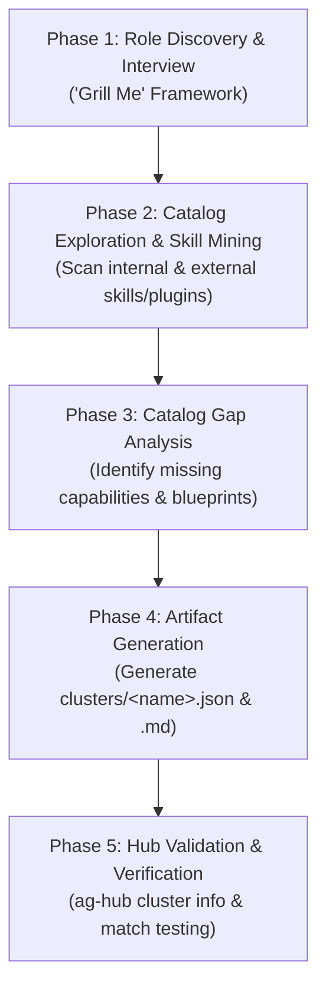

# Cluster Role Creation: Role-Based Skill Cluster Designer

This skill equips an agent to act as a **Cluster Role Designer** for the Antigravity Skills Hub. It provides an end-to-end operational framework for defining new specialized roles, mining the hub's catalog for matching skills/plugins, identifying capability gaps, and producing both the machine-readable cluster JSON manifest and human-readable companion documentation.

---

## When to Use This Skill

Activate this skill whenever the user asks to:
- Define a new professional role or persona (e.g., "Azure MLOps Engineer", "Cloud Security Architect", "FinOps Specialist", "Frontend Lead").
- Create a new skill cluster in `clusters/` bundling relevant skills and plugins from internal and external sources.
- Perform a catalog gap analysis to identify missing skills needed for a given technical domain.
- Generate companion documentation (`clusters/<role-name>.md`) explaining role scope, competency breakdown, and catalog gaps.

---

## The 5-Phase Cluster Design Lifecycle



---

### Phase 1: Interactive Role Discovery & Clarification Interview

Before selecting skills or generating cluster files, an agent **must** clarify any ambiguities about the role's scope, operational tier, and technical boundaries. Use interactive questioning tools (e.g., `ask_question`) or structured questions.

#### Core Inquiry Axes

1. **Macro-Topology & Environment**:
   - Centralized data warehouse vs. Decentralized Data Mesh / Lakehouse?
   - Multi-cloud / Hybrid vs. Single-cloud native (GCP, AWS, Azure)?
   - Greenfield platform design vs. Legacy migration/modernization (e.g., Teradata/Snowflake to BigQuery)?
2. **Operational Tier & Decision Boundaries**:
   - Is the role focused on strategic architecture and governance (Enterprise Architect), or hands-on pipeline implementation (Data Engineer)?
   - Does the role manage infrastructure-as-code (Terraform) or platform policies (IAM, VPC-SC, PAM)?
3. **Governance, Compliance & Regulatory Constraints**:
   - What data protection standards apply (HIPAA, GDPR, PCI-DSS, FedRAMP)?
   - Is dynamic data masking (DLP) or tokenization required?
   - How are data quality and data contracts enforced across domain boundaries?
4. **Tooling & Technology Stack**:
   - What storage, transformation, orchestration, and query engines are in scope (e.g., BigQuery, Dataplex, Cloud Storage, dbt, Spark, Dataflow, Airflow)?

---

### Phase 2: Catalog Exploration & Skill Mining

Explore the hub's catalog across both `internal/` and `external/` repositories to discover candidate skills and plugins.

#### Steps to Mine the Catalog

1. **List All Hub Skills**:
   ```bash
   ag-hub list
   # Or inspect internal typology and external directories directly:
   # ls internal/ (e.g. internal/hub-tools/, internal/skills/, internal/<typology>/)
   # ls external/*/skills/ (or respective submodule skill directories)
   ```
2. **Search for Domain Keywords**:
   - Search skill names and descriptions for domain-specific terms (e.g., `lakehouse`, `lineage`, `security`, `optimization`, `finops`, `dataplex`, `spanner`, `dbt`).
3. **Categorize Candidates by Competency**:
   - Group discovered skills into 4 to 6 logical architectural pillars (e.g., *Topology & Storage*, *Governance & Lineage*, *Security & Zero-Trust*, *FinOps & Cost Optimization*, *Data Pipelines*, *Modernization*).
4. **Identify Candidate Plugins**:
   - Check `internal/plugins/` or external plugin definitions for bundled rule sets that apply to the role (e.g., `googlecloud-data`).

---

### Phase 3: Catalog Gap Analysis & Missing Skills Specification

A comprehensive cluster design must not only map existing skills, but also identify **critical capability gaps**—essential skills that the role requires in enterprise practice, but which are not yet available in the catalog.

#### Gap Identification Methodology

1. Compare the role's ideal responsibilities against the skills discovered in Phase 2.
2. For each missing capability, document:
   - **Skill Identifier**: Recommended kebab-case name (e.g., `gcp-analytics-hub-data-sharing`, `dataplex-data-quality-autodq`).
   - **Architectural Need**: Why the role cannot operate autonomously without this capability.
   - **Key Capabilities**: 3–4 specific technical tasks the skill should automate or guide.
   - **Implementation Blueprint**: Recommended approach to author the skill in `internal/<typology>/<name>/SKILL.md` (e.g. `internal/data-platform/<name>/`, `internal/hub-tools/`, or general `internal/skills/<name>/`).

---

### Phase 4: Standardized Artifact Generation

For every approved role, generate two companion files in `clusters/`:
1. `clusters/<role-name>.json`: Machine-readable cluster manifest used by `ag-hub`.
2. `clusters/<role-name>.md`: Human-facing architectural blueprint and documentation.

#### 1. Manifest Specification: `clusters/<role-name>.json`

```json
{
  "name": "<role-name>",
  "description": "<High-level role summary and primary architectural focus>",
  "skills": [
    "<skill-identifier-1>",
    "<skill-identifier-2>",
    "<skill-identifier-n>"
  ],
  "plugins": [
    "<plugin-identifier-1>"
  ]
}
```

*Rules:*
- File must be located at `clusters/<role-name>.json`.
- Skill names must exactly match registered skill identifiers in the hub catalog.
- If no plugins are needed, set `"plugins": []`.

#### 2. Documentation Specification: `clusters/<role-name>.md`

The companion markdown file **must** include the following 3 canonical sections:

```markdown
# Role Blueprint: <Role Title>

This document serves as the architectural reference and companion guide to the [`clusters/<role-name>.json`](./<role-name>.json) cluster definition.

---

## 1. Role Definition: <Role Title>

<Detailed description defining the role, target scope, organizational responsibilities, and how it differentiates from adjacent roles (e.g. Architect vs. Engineer).>

### Architecture Topology Diagram
<Mermaid diagram (flowchart TD or flowchart LR) visualizing the domains, platform services, governance layers, and security perimeters relevant to the role.>

### Core Architectural Pillars
<Detailed numbered breakdown of the 4–6 pillars that form the foundation of this role.>

---

## 2. Skill Breakdown by Competency

The [`<role-name>`](./<role-name>.json) cluster bundles **<N> skills** and **<M> plugins** mapped directly to the core architectural pillars:

| Competency Domain | Skill / Plugin Identifier | Architectural Rationale | Provenance Source |
| :--- | :--- | :--- | :--- |
| **<Domain 1>** | `<skill-id>` | <Why this skill is included and how the role uses it> | `<source-repo>` |
| ... | ... | ... | ... |

---

## 3. Missing Skills Analysis (Catalog Gaps)

<Summary of missing competencies that are essential to the role but not yet available in the catalog.>

| Missing Skill | Critical Enterprise Capability | Recommended Implementation Path |
| :--- | :--- | :--- |
| **`<missing-skill-id>`** | <Description of required capabilities> | Scaffold in `internal/<typology>/<missing-skill-id>` (or `ag-hub create skill <id> -g <group>`) with <templates/tools>. |

### Gap Details & Blueprint Specifications
<Detailed breakdown for each missing skill including Architectural Need, Key Capabilities, and Recommended Implementation Blueprint.>
```

---

### Phase 5: Hub Validation & Verification

Always verify the newly generated cluster using `ag-hub`:

1. **Verify Cluster Discovery & Info**:
   ```bash
   ag-hub cluster list
   ag-hub cluster info <role-name>
   ```
   *Confirm that all skills are properly found, grouped, and mapped to their source repositories.*

2. **Verify Temporary Workspace Activation**:
   ```bash
   # Test enabling the cluster in an isolated workspace
   TMP_DIR=$(mktemp -d)
   ag-hub -w "$TMP_DIR" enable -c <role-name>
   ag-hub -w "$TMP_DIR" status
   ag-hub -w "$TMP_DIR" disable -c <role-name>
   rm -rf "$TMP_DIR"
   ```

3. **Update Documentation**:
   - Add the new cluster to the Predefined Clusters table in [`README.md`](../../README.md).
