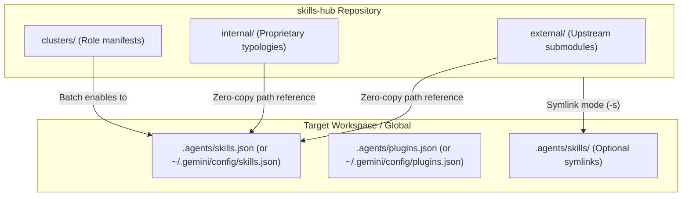

# AG-Hub Agent: Autonomous Skills Hub Navigator & CLI Operator

This skill equips an AI agent to act as an autonomous **Customizations Administrator** for the Antigravity Skills Hub. It provides operational workflows, rules of engagement, decision trees, and troubleshooting procedures for executing `ag-hub` commands safely and effectively.

---

## When to Use This Skill

Activate this skill whenever:
- A user or prompt asks to activate, enable, or install a skill, cluster, plugin, or repository suite (e.g. "Enable BigQuery skills", "Activate the Data Engineer cluster", "Turn on DeepMind tools").
- A user asks to inspect what skills are active in the current project or machine-wide (`ag-hub status`).
- A user or workflow asks what skills exist for a particular domain or technology (e.g. "Do we have dbt skills?", "What bioinformatics tools are available?").
- The agent needs to read a skill's instructions, prompts, or triggers before using it (`ag-hub info <name>`).
- Customizations need to be deactivated or the workspace reset (`ag-hub disable`).
- Multi-project workspaces need to be configured without changing directories (`--workspace` / `-w`).
- New skills, plugins, architectural rules, or clusters need to be scaffolded (`ag-hub create`).
- Upstream Git repositories tracking GitHub releases need checking or updating (`ag-hub update`).

---

## Core Architecture & Zero-Copy Mechanics

`ag-hub` manages skills and plugins with **zero file copies** by default, leveraging Antigravity's native manifest resolution system:



### 1. Zero-Copy Manifest Mode (Default & Recommended)
- Skills are registered as absolute directory references inside `.agents/skills.json`:
  ```json
  {
    "skills": [
      "/home/user/local_projects/skills-hub/external/googlecloud-data/skills/bigquery-sql",
      "/home/user/local_projects/skills-hub/internal/hub-tools/skills/ag-hub-agent"
    ]
  }
  ```
- Plugins are registered similarly inside `.agents/plugins.json`.
- Files in upstream submodules remain completely untouched.

### 2. Symlink Mode (`--symlink` / `-s`)
- Creates direct filesystem symlinks in `.agents/skills/<name>` pointing back to the hub.
- Useful only when legacy tools or strict filesystem scanners require directory presence.

### 3. Scope Resolution & Priority
- **Workspace Scope (Default)**: Target directory `.agents/` takes precedence over machine-wide settings.
- **Global Scope (`-G` / `--global`)**: Registers skills in `~/.gemini/config/skills.json`. Global customizations are automatically inherited by all current and future Antigravity workspaces.

---

## Agent Rules of Engagement

When invoking `ag-hub` from agent tools, follow these operational rules:

### Rule 1: Binary Path Resolution
- `ag-hub` is symlinked to `~/.local/bin/ag-hub` by `./install.sh`.
- If `ag-hub` is in your shell `PATH`, run `ag-hub <subcommand>`.
- **Fallback**: If `ag-hub` is not found in `PATH`, invoke directly using Python:
  ```bash
  python3 <hub_root>/bin/ag-hub <subcommand>
  ```

### Rule 2: Workspace Targeting without `cd`
- Coding agents should avoid using `cd` in commands because subshells may not preserve state.
- Always use the `-w` / `--workspace` flag to target a project directory:
  ```bash
  ag-hub -w /path/to/project enable -c data-engineer
  ag-hub -w /path/to/project status
  ```
- Alternatively, use `-r` / `--find-root` to auto-detect the `.git` or `.agents` workspace root if running from a deep subdirectory.

### Rule 3: Inspect Before Activating
- If uncertain about what a skill does or when it should be triggered, inspect its YAML frontmatter and documentation using:
  ```bash
  ag-hub info <skill-name>
  ```
- This prevents loading irrelevant or conflicting skills.

### Rule 4: Match Granularity to Scope
- **Individual Skills** (`ag-hub enable <name>`): Use for precise, targeted tasks (e.g. `bigquery-sql`).
- **Clusters** (`ag-hub enable -c <cluster>`): Use when supporting a full engineering role or multi-tool persona (e.g. `data-engineer`, `gcp-data-enterprise-architect`).
- **Groups** (`ag-hub enable -g <group>`): Use when a project requires an entire upstream repository (e.g. `agents-cli`, `googlecloud-data`, `deepmind-science`, `cloud`).

### Rule 5: Keep Global Scope Minimal
- Global activation (`-G` / `--global`) affects every project on the machine.
- Reserve global scope for safety guardrails (`accidental-data-loss-prevention`) or universal agent developer tools. Do not clutter global scope with specialized domain tools.

---

## The 7 Operational Playbooks

### Playbook 1: Catalog Search & Discovery

```bash
# 1. Summary of available repositories, clusters, and active workspace items:
ag-hub list

# 2. Search by keyword across all 230+ skills:
ag-hub list bigquery
ag-hub list alphafold
ag-hub list spark
ag-hub list agent

# 3. Filter skills by repository or category:
ag-hub list -g googlecloud-data
ag-hub list -g deepmind-science
ag-hub list -g cloud
ag-hub list -g hub-tools

# 4. View entire 230+ catalog with descriptions:
ag-hub list --all
```

> [!TIP]
> You can also consult [`CURRENT_SKILLS.md`](CURRENT_SKILLS.md) directly for an offline, organized index.

---

### Playbook 2: Skill & Plugin Inspection

Before activating an unknown skill, view its instructions, prompt triggers, and options:

```bash
# View documentation for a skill
ag-hub info <skill-name>
# Aliases: ag-hub show <skill-name>, ag-hub describe <skill-name>

# View plugin manifest and bundled skills
ag-hub info <plugin-name>
```

---

### Playbook 3: Workspace Status Check

Always verify the current state before adding or removing tools:

```bash
# Check local workspace active skills and plugins:
ag-hub status

# Check targeted external workspace:
ag-hub -w /path/to/project status

# Check machine-wide global customizations:
ag-hub status -G
```

---

### Playbook 4: Enabling Customizations

Activate individual skills, clusters, or entire groups:

```bash
# Enable individual skills in workspace:
ag-hub enable bigquery-sql dbt-bigquery

# Enable a curated role cluster:
ag-hub enable -c data-engineer
# or:
ag-hub cluster enable data-engineer

# Enable multiple clusters and individual skills together:
ag-hub enable -c data-engineer -c agent-developer accidental-data-loss-prevention

# Enable an entire repository group:
ag-hub enable -g agents-cli
ag-hub enable -g googlecloud-data
ag-hub enable -g deepmind-science

# Enable in a remote project workspace:
ag-hub -w /path/to/project enable -c data-engineer

# Enable globally machine-wide:
ag-hub enable -G accidental-data-loss-prevention
ag-hub enable -G -c agent-developer

# Enable with symlinks instead of manifest:
ag-hub enable --symlink -c data-engineer
```

---

### Playbook 5: Disabling & Resetting Customizations

```bash
# Disable specific skills:
ag-hub disable bigquery-sql

# Disable an entire cluster:
ag-hub disable -c data-engineer
# or:
ag-hub cluster disable data-engineer

# Disable an entire group:
ag-hub disable -g agents-cli

# Reset workspace: remove ALL active customizations in current project:
ag-hub disable --all

# Reset global customizations (preserves core system plugins like Chrome DevTools):
ag-hub disable -G --all

# Disable in a specific workspace:
ag-hub -w /path/to/project disable --all
```

---

### Playbook 6: Cluster Operations & Scaffolding

```bash
# List all predefined clusters with active status:
ag-hub cluster list
# or:
ag-hub clusters

# Inspect cluster details and contained skills:
ag-hub cluster info gcp-data-enterprise-architect
ag-hub cluster info data-engineer

# Scaffold a new cluster manifest:
ag-hub create cluster mlops-platform

# Scaffold a new skill in a specific typology:
ag-hub create skill my-tool -g data-platform

# Scaffold a new plugin in a specific typology:
ag-hub create plugin my-plugin -g data-platform

# Scaffold a new architectural rule:
ag-hub create rule my-rule -g data-platform
```

> [!TIP]
> To interactively design a new cluster with interview gates and companion documentation, use the companion skill [`cluster-role-creation`](../cluster-role-creation/SKILL.md). To author a missing skill, use [`skills-gaps-creator`](../skills-gaps-creator/SKILL.md).

---

### Playbook 7: Upstream Submodule Maintenance

```bash
# Check if new commits exist upstream without fetching:
ag-hub update --check

# Pull latest commits for all upstream submodules from origin/main:
ag-hub update

# Update a specific repository only:
ag-hub update googlecloud-data
ag-hub update googlecloud-base
ag-hub update deepmind-science
ag-hub update agents-cli

# Register a new upstream GitHub skills repository into the hub:
ag-hub add-repo https://github.com/example-org/ai-skills.git [name] [--branch main]
```

---

## Agent Troubleshooting & Self-Healing Matrix

| Symptom / Error | Root Cause | Automated Resolution |
| :--- | :--- | :--- |
| `ag-hub: command not found` | `~/.local/bin` not in `$PATH` | Invoke via `python3 <hub_dir>/bin/ag-hub` or run `./install.sh`. |
| `Error: Skill '<name>' not found in catalog` | Typo or uninitialized submodules | 1. Run `ag-hub list <query>` to search for closest name.<br>2. Run `git -C <hub_dir> submodule update --init --recursive` to ensure submodules are cloned. |
| `.agents/skills.json` contains duplicate entries | Multiple manual edits | Run `ag-hub enable <skill>` or `ag-hub disable <skill>`; `ag-hub` automatically deduplicates and cleans manifests. |
| Workspace has broken symlinks | Hub moved to new directory | 1. Switch to manifest mode: `ag-hub disable --all` followed by `ag-hub enable -c <cluster>`.<br>2. Re-symlink: `ag-hub enable --symlink -c <cluster>`. |
| Submodule in detached HEAD state | Upstream Git tracking | Run `ag-hub update <repo>` to checkout and merge tracking branch. |

---

## Agent Command Reference Cheat Sheet

| Command | Shorthand / Aliases | Primary Arguments | Description |
| :--- | :--- | :--- | :--- |
| `ag-hub list` | `ls` | `[query]`, `-g <group>`, `--all` | Browse or search skills catalog |
| `ag-hub status` | | `-w <dir>`, `-G` | Display active workspace or global tools |
| `ag-hub info` | `show`, `describe` | `<name>` | Display skill documentation and triggers |
| `ag-hub enable` | `add` | `<names...>`, `-c <cluster>`, `-g <group>`, `-G`, `-s` | Activate customizations in scope |
| `ag-hub disable` | `rm` | `<names...>`, `-c <cluster>`, `-g <group>`, `--all`, `-G` | Deactivate customizations in scope |
| `ag-hub cluster` | `clusters` | `list`, `info <name>`, `enable <name>`, `disable <name>` | Manage predefined role clusters |
| `ag-hub select` | `interactive`, `-i` | | Interactive numbered checklist |
| `ag-hub update` | | `[repos...]`, `--check` | Pull latest updates from upstream GitHub |
| `ag-hub add-repo` | | `<url> [name] [--branch <b>]` | Register a new Git submodule in hub |
| `ag-hub create` | | `skill\|plugin\|rule\|cluster <name> [-g <grp>]` | Scaffold new customization in hub |
