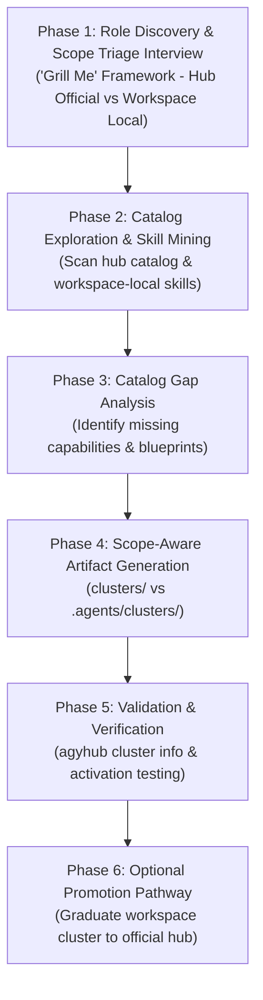

# Cluster Role Creation: Role-Based Skill Cluster Designer

This skill equips an agent to act as a **Cluster Role Designer** for the Antigravity Skills Hub. It provides an end-to-end operational framework for defining new specialized roles, mining the hub's catalog (and workspace-local skills) for matching skills/plugins, identifying capability gaps, and producing both the machine-readable cluster JSON manifest and human-readable companion documentation.

Clusters can be scoped as either:
1. **Official Hub Clusters** (`clusters/<name>.json`): Universal, shared personas contributed to the central skills-hub catalog.
2. **Workspace-Specific Clusters** (`<workspace>/.agents/clusters/<name>.json`): Project-specific, proprietary, or experimental personas scoped strictly to the current workspace without modifying the official catalog.

---

## When to Use This Skill

Activate this skill whenever the user asks to:
- Define a new professional role or persona (e.g., "Azure MLOps Engineer", "Cloud Security Architect", "FinOps Specialist", "Frontend Lead").
- Create a workspace-specific cluster role in `.agents/clusters/` for a specific project without altering the central skills-hub.
- Create an official skill cluster in `clusters/` bundling relevant skills and plugins from internal and external sources.
- Perform a catalog gap analysis to identify missing skills needed for a given technical domain.
- Generate companion documentation (`<role-name>.md`) explaining role scope, competency breakdown, and catalog gaps.
- Promote a proven workspace-local cluster to an official hub cluster.

---

## The 6-Phase Cluster Design Lifecycle



---

### Phase 1: Interactive Role Discovery & Scope Triage Interview

Before selecting skills or generating cluster files, an agent **must** clarify any ambiguities about the role's scope, operational tier, target repository, and technical boundaries. Use interactive questioning tools (e.g., `ask_question`) or structured inquiries.

#### Mandatory Gate 0: Scope Determination (Official Hub vs. Workspace Local)

Ask the user:
> **"Should this cluster role be created as an Official Hub Cluster (contributed to `clusters/` for universal use) or a Workspace-Specific Cluster (saved in your project's `.agents/clusters/`)?"**

| Criterion | Official Hub Cluster (`clusters/`) | Workspace-Specific Cluster (`.agents/clusters/`) |
| :--- | :--- | :--- |
| **Applicability** | Universal engineering archetype (e.g., Data Engineer, Cloud Architect) | Project-specific, client-specific, or proprietary stack |
| **Storage Location** | `<hub_dir>/clusters/<role-name>.json` | `<workspace_root>/.agents/clusters/<role-name>.json` |
| **Documentation** | `<hub_dir>/clusters/<role-name>.md` | `<workspace_root>/.agents/clusters/<role-name>.md` |
| **Hub Catalog Sync** | Added to `README.md` predefined clusters table | **Never** touches hub `README.md` or hub `clusters/` |
| **Version Control** | Committed to the `skills-hub` repository | Committed to the project repository or ignored |

*Rule of Thumb*: Default to **Workspace-Specific** if the command is run inside an external project workspace or if the persona includes proprietary project rules. Default to **Official Hub** if working directly on skills-hub to add canonical roles.

#### Core Inquiry Axes

1. **Macro-Topology & Environment**:
   - Centralized data warehouse vs. Decentralized Data Mesh / Lakehouse?
   - Multi-cloud / Hybrid vs. Single-cloud native (GCP, AWS, Azure)?
   - Greenfield platform design vs. Legacy migration/modernization (e.g., Teradata/Snowflake to BigQuery)?
2. **Operational Tier & Decision Boundaries**:
   - Is the role focused on strategic architecture and governance (Enterprise Architect), or hands-on pipeline implementation (Data Engineer)?
   - Does the role manage infrastructure-as-code (Terraform) or platform policies (IAM, VPC-SC, PAM)?
3. **Governance, Compliance & Regulatory Constraints**:
   - What data protection standards apply (HIPAA, GDPR, PCI-DSS, FedRAMP)?
   - Is dynamic data masking (DLP) or tokenization required?
   - How are data quality and data contracts enforced across domain boundaries?
4. **Tooling & Technology Stack**:
   - What storage, transformation, orchestration, and query engines are in scope (e.g., BigQuery, Dataplex, Cloud Storage, dbt, Spark, Dataflow, Airflow)?

---

### Phase 2: Catalog Exploration & Skill Mining

Explore the available skills and plugins across both the hub catalog and local workspace skills.

#### Steps to Mine Skills

1. **List All Hub Skills**:
   ```bash
   agyhub list
   ```
2. **Inspect Workspace-Local Skills (for Workspace Clusters)**:
   - Check `<workspace_root>/.agents/skills/` or project-specific skill directories for custom skills already present in the workspace.
3. **Search for Domain Keywords**:
   - Search skill names and descriptions for domain-specific terms (e.g., `lakehouse`, `lineage`, `security`, `optimization`, `finops`, `dataplex`, `spanner`, `dbt`).
4. **Categorize Candidates by Competency**:
   - Group discovered skills into 4 to 6 logical architectural pillars (e.g., *Topology & Storage*, *Governance & Lineage*, *Security & Zero-Trust*, *FinOps & Cost Optimization*, *Data Pipelines*, *Modernization*).
5. **Identify Candidate Plugins**:
   - Check for active or available plugins (e.g., `googlecloud-data`). Note that bundled skills inside plugins will automatically be provided by the plugin.

---

### Phase 3: Catalog Gap Analysis & Missing Skills Specification

A comprehensive cluster design must not only map existing skills, but also identify **critical capability gaps**—essential skills that the role requires in enterprise practice, but which are not yet available in the catalog.

#### Gap Identification Methodology

1. Compare the role's ideal responsibilities against the skills discovered in Phase 2.
2. For each missing capability, document:
   - **Skill Identifier**: Recommended kebab-case name (e.g., `gcp-analytics-hub-data-sharing`, `dataplex-data-quality-autodq`).
   - **Architectural Need**: Why the role cannot operate autonomously without this capability.
   - **Key Capabilities**: 3–4 specific technical tasks the skill should automate or guide.
   - **Implementation Blueprint**:
     - *If Official Hub*: Recommend scaffolding in `internal/<typology>/skills/<name>/SKILL.md` (or `agyhub create skill <name> -g <group>`).
     - *If Workspace-Specific*: Recommend scaffolding in `<workspace_root>/.agents/skills/<name>/SKILL.md` for project isolation.

---

### Phase 4: Scope-Aware Artifact Generation

For every approved role, generate two companion files based on the target scope decided in Phase 1:

#### Target File Paths

- **Official Hub Cluster**:
  - Manifest: `clusters/<role-name>.json`
  - Documentation: `clusters/<role-name>.md`
- **Workspace-Specific Cluster**:
  - Manifest: `<workspace_root>/.agents/clusters/<role-name>.json`
  - Documentation: `<workspace_root>/.agents/clusters/<role-name>.md`
  *(Ensure `<workspace_root>/.agents/clusters/` directory exists before writing).*

#### 1. Manifest Specification (`<role-name>.json`)

```json
{
  "name": "<role-name>",
  "description": "<High-level role summary and primary architectural focus>",
  "skills": [
    "<skill-identifier-1>",
    "<skill-identifier-2>",
    "<skill-identifier-n>"
  ],
  "plugins": [
    "<plugin-identifier-1>"
  ]
}
```

*Rules:*
- Skill names must match registered skill identifiers in the hub catalog or workspace manifest.
- If no plugins are needed, set `"plugins": []`.

#### 2. Documentation Specification (`<role-name>.md`)

The companion markdown file **must** include the following canonical sections:

```markdown
# Role Blueprint: <Role Title>

This document serves as the architectural reference and companion guide to the [`<role-name>.json`](./<role-name>.json) cluster definition.

---

## 1. Role Definition: <Role Title>

<Detailed description defining the role, target scope, organizational responsibilities, and how it differentiates from adjacent roles (e.g. Architect vs. Engineer).>

### Architecture Topology Diagram
<Mermaid diagram (flowchart TD or flowchart LR) visualizing the domains, platform services, governance layers, and security perimeters relevant to the role.>

### Core Architectural Pillars
<Detailed numbered breakdown of the 4–6 pillars that form the foundation of this role.>

---

## 2. Skill Breakdown by Competency

The [`<role-name>`](./<role-name>.json) cluster bundles **<N> skills** and **<M> plugins** mapped directly to the core architectural pillars:

| Competency Domain | Skill / Plugin Identifier | Architectural Rationale | Provenance Source |
| :--- | :--- | :--- | :--- |
| **<Domain 1>** | `<skill-id>` | <Why this skill is included and how the role uses it> | `<source-repo>` |
| ... | ... | ... | ... |

---

## 3. Missing Skills Analysis (Catalog Gaps)

<Summary of missing competencies that are essential to the role but not yet available in the catalog.>

| Missing Skill | Critical Enterprise Capability | Recommended Implementation Path |
| :--- | :--- | :--- |
| **`<missing-skill-id>`** | <Description of required capabilities> | Scaffold in `internal/<typology>/skills/<missing-skill-id>` or `.agents/skills/<missing-skill-id>` |

### Gap Details & Blueprint Specifications
<Detailed breakdown for each missing skill including Architectural Need, Key Capabilities, and Recommended Implementation Blueprint.>
```

---

### Phase 5: Validation & Verification

Verify the newly generated cluster using `agyhub`:

#### For Workspace-Specific Clusters:
1. **Verify Workspace Discovery**:
   ```bash
   agyhub cluster list
   # Notice the [WORKSPACE] badge next to your cluster name
   ```
2. **Inspect Cluster Details**:
   ```bash
   agyhub cluster info <role-name>
   # Confirm Source File points to .agents/clusters/<role-name>.json
   ```
3. **Verify Activation in Workspace**:
   ```bash
   agyhub enable -c <role-name>
   agyhub status
   ```
4. **Governance & VCS Advice**:
   - **DO NOT** edit the hub's `README.md` or commit anything to `clusters/`.
   - **Team Sharing**: If other team members working on this project should have access to this cluster role, commit `.agents/clusters/` into the project repository.
   - **Private Persona**: If this role is purely personal or temporary, add `.agents/clusters/` to the project's `.gitignore`.

#### For Official Hub Clusters:
1. **Verify Hub Discovery & Info**:
   ```bash
   agyhub cluster list
   # Notice the [HUB] badge
   agyhub cluster info <role-name>
   ```
2. **Verify Temporary Workspace Activation**:
   ```bash
   TMP_DIR=$(mktemp -d)
   agyhub -w "$TMP_DIR" enable -c <role-name>
   agyhub -w "$TMP_DIR" status
   agyhub -w "$TMP_DIR" disable -c <role-name>
   rm -rf "$TMP_DIR"
   ```
3. **Update Hub Catalog**:
   - Add the new cluster to the Predefined Clusters table in [`README.md`](../../../../README.md).

---

### Phase 6: Graduation / Promotion Pathway

If a cluster role initially authored as a **Workspace-Specific Cluster** proves universally valuable across multiple engineering teams and projects, it can be promoted to an **Official Hub Cluster**:

1. **Copy Artifacts to Hub**:
   ```bash
   cp .agents/clusters/<role-name>.json clusters/<role-name>.json
   cp .agents/clusters/<role-name>.md clusters/<role-name>.md
   ```
2. **Remove Local Workspace Override**:
   ```bash
   rm .agents/clusters/<role-name>.json .agents/clusters/<role-name>.md
   ```
3. **Validate Hub Scope**:
   ```bash
   agyhub cluster list
   # Confirms scope badge is now [HUB]
   agyhub cluster info <role-name>
   ```
4. **Register in Hub Documentation**:
   - Add the role to the Predefined Clusters table in `README.md`.
