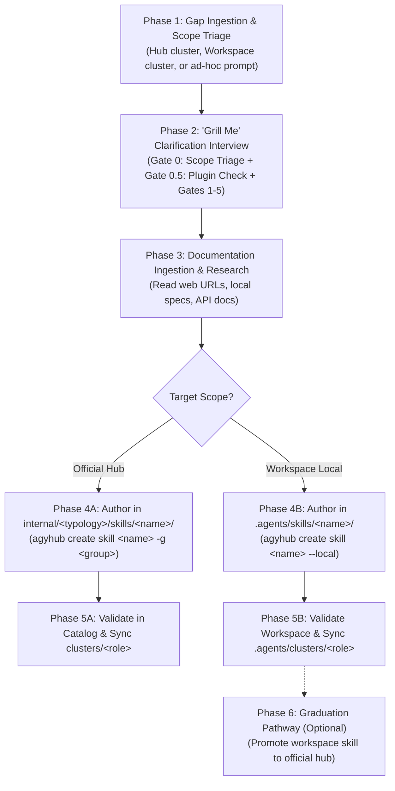

# Agyhub Skills Gap Creator: Specialized Skill Authoring Assistant

This skill equips an agent to act as a **Skill Engineer** within the Antigravity Skills Hub ecosystem. It provides a structured, rigorous methodology for transforming an identified capability gap—whether documented in an official hub cluster specification (`clusters/<role-name>.md`), a workspace-specific cluster blueprint (`.agents/clusters/<role-name>.md`), or requested on-demand by a user—into a production-grade, highly targeted, and verified skill.

---

## When to Use This Skill

Activate this skill whenever:
- The user requests to create or author a missing skill identified during a cluster gap analysis (e.g., from `clusters/<role-name>.md` or `.agents/clusters/<role-name>.md`).
- The user asks to build a new custom skill for a specific workflow, tool, or integration from scratch.
- An agent needs guidance on interviewing the user, determining target scope (Official Hub vs. Workspace-Local), checking for catalog/plugin redundancy, gathering authoritative documentation links, defining strict boundaries, and packaging an Antigravity skill using progressive disclosure.

> [!NOTE]
> **Independent Lifecycle**: Creating gap skills is completely decoupled from role creation. It can be run as a standalone task at any time, for any domain, project workspace, or engineering team.

---

## The 6-Phase Skill Creation Lifecycle



---

### Phase 1: Gap Ingestion & Scope Triage

Accept and parse the skill requirement from either of three entry points:

1. **From an Official Hub Cluster Blueprint**:
   - Locate the cluster companion markdown: `clusters/<role-name>.md`.
   - Inspect **Section 3: Missing Skills Analysis (Catalog Gaps)**.
   - Extract the recommended skill identifier, architectural need, and key capabilities.
   - Default target scope: **Official Hub** (`internal/<typology>/skills/`).

2. **From a Workspace-Specific Cluster Blueprint**:
   - Locate the workspace cluster companion markdown: `<workspace_root>/.agents/clusters/<role-name>.md`.
   - Inspect **Section 3: Missing Skills Analysis (Catalog Gaps)**.
   - Extract the recommended skill identifier and project-specific requirements.
   - Default target scope: **Workspace-Local** (`<workspace_root>/.agents/skills/`).

3. **From an Ad-Hoc User Request**:
   - Extract the user's intended skill name, target platform/technology, and desired automation.
   - Clarify the intended target scope during Phase 2.

---

### Phase 2: The "Grill Me" Clarification Interview

To prevent bloated, vague, or overlapping skills, the agent **must** conduct an interactive interview ("Grill Me") with the user before writing any files. Use interactive tools (e.g., `ask_question`) or structured inquiries.

#### Mandatory Interview Gates

#### Gate 0: Scope Determination (Official Hub vs. Workspace-Local)
Establish where the skill should live:
- **Option A: Official Hub Skill (`internal/<typology>/skills/<skill-name>/`)**
  - Universally reusable across all projects, repositories, and engineering teams.
  - Published and version-controlled within the central `skills-hub` repository.
  - Requires assigning a typology domain group (e.g., `hub-tools`, `data-platform`, `customer-engagement`, `templates`).
- **Option B: Workspace-Local Skill (`<workspace_root>/.agents/skills/<skill-name>/`)**
  - Scoped strictly to the active workspace project.
  - Ideal for project-specific automation, proprietary business rules, internal private APIs, or experimental workflows.
  - **Zero file modifications** to the `skills-hub` repository.
  - Shared via the project repository or kept private via `.gitignore`.

#### Gate 0.5: Pre-Creation Redundancy & Plugin Check
- Scan existing catalog plugins (e.g. `googlecloud-data`, `google-antigravity-sdk`) and active workspace plugins.
- **Rule**: If the requested capability is already bundled inside an existing plugin in the catalog, advise the user to enable or include the plugin instead of authoring redundant standalone instructions.

#### Gate 1: Precise Boundaries & Anti-Scope
- **What MUST this skill do?** What are the top 2–4 concrete workflows or tasks it automates?
- **What must this skill NOT do (Anti-Scope)?** Where are the boundaries?
  *Example*: For `gcp-analytics-hub-data-sharing`, it designs and manages exchanges and listings, but does *not* write ETL transformations (handled by `gcp-data-pipelines`) or configure VPC networks (handled by `foundation-builder`).

#### Gate 2: Activation Triggers & User Intent
- What specific user prompts, questions, or file contexts should cause an agent to activate this skill?
- What third-person description should be placed in YAML frontmatter to ensure accurate progressive disclosure?

#### Gate 3: Authoritative Documentation & Reference Links
- Ask the user for authoritative documentation links:
  - **Official vendor documentation URLs** (e.g. Google Cloud docs, API reference, Terraform registry).
  - **Local specification files or reference implementations** (e.g. existing YAML configs, Python scripts, architectural schemas).
  - If the user does not have links immediately at hand, propose authoritative documentation sources and confirm with the user before proceeding.

#### Gate 4: Execution Architecture & Asset Model
- Will this skill be purely procedural guidance in `SKILL.md`, or does it require:
  - **Executable scripts** in `scripts/` (e.g. validation script, CLI wrapper, linter)?
  - **Templates / Schemas** in `resources/` (e.g. declarative YAML templates, JSON schemas, policy templates)?
  - **Deep-dive references** in `references/` (e.g. API parameter tables, troubleshooting matrices) for progressive disclosure?

#### Gate 5: Scaffolding Dispatch
- **For Official Hub Skills**:
  ```bash
  python3 bin/agyhub create skill <skill-name> -g <typology>
  ```
  Scaffolds in `internal/<typology>/skills/<skill-name>/`.
- **For Workspace-Local Skills**:
  ```bash
  python3 bin/agyhub create skill <skill-name> --local
  ```
  Scaffolds in `<workspace_root>/.agents/skills/<skill-name>/`.

---

### Phase 3: Documentation Ingestion & Research

Once reference URLs or local files are identified:
1. **Fetch & Read Documentation**:
   - Use `read_url_content` to fetch public documentation pages.
   - Use `view_file` to inspect local files or repository references.
   - If specific API endpoints or CLI flags are ambiguous, search official docs to retrieve exact parameter names.
2. **Synthesize Technical Facts**:
   - Extract exact CLI commands (e.g., `gcloud ...`, `bq ...`, `terraform ...`).
   - Extract exact configuration schemas, mandatory fields, and default values.
   - Identify common error patterns, quotas, or failure modes.

---

### Phase 4: Progressive Disclosure Authoring & Packaging

Author the skill following the Antigravity progressive disclosure architecture:

#### Target File Locations
- **Official Hub Skill**: `internal/<typology>/skills/<skill-name>/`
- **Workspace-Local Skill**: `<workspace_root>/.agents/skills/<skill-name>/`

```text
<target_skill_directory>/
├── SKILL.md          # Required: Lean instruction file with YAML frontmatter
├── references/       # Recommended: Deep API reference, parameter guides, manuals
├── scripts/          # Optional: Python or shell helper scripts
└── resources/        # Optional: Reusable YAML templates, JSON schemas, boilerplates
```

#### 1. Authoring `SKILL.md`

`SKILL.md` must be lean, structured, and focused. Bulky reference tables belong in `references/`.

```markdown
---
name: <skill-name>
description: >-
  <Third-person description stating EXACTLY what the skill does and WHEN to activate it.>
  Example: "Guides designing, publishing, and subscribing to Google Cloud Analytics Hub data exchanges and clean rooms. Activate when configuring cross-project dataset sharing or listings."
---

# <Skill Title>

<Brief 2-3 sentence overview of the capability.>

## When to Use This Skill
- **Activate when**: <List 3-5 explicit trigger scenarios, user questions, or file types>
- **Do NOT activate when**: <Explicit anti-scope boundaries; mention which other skills handle those>

## Workflow & Guidelines

### 1. <Step 1: Prerequisites / Discovery>
<Instructions, discovery commands, or pre-flight checks.>

### 2. <Step 2: Core Procedure / Configuration>
<Numbered, copy-pasteable commands and declarative configurations.>

```bash
# Example command
...
```

### 3. <Step 3: Verification & Quality Validation>
<How to verify the output, check logs, or validate syntax.>

## References & Resources
- Link to deep-dive files in `references/` (e.g., `[API Reference](./references/api-guide.md)`).
- Link to templates in `resources/` (e.g., `[Sample YAML](./resources/template.yaml)`).
- Link to helper scripts in `scripts/` (e.g., `[Validator](./scripts/validate.py)`).
```

#### 2. Authoring Supporting Assets (As Needed)

- **`references/`**: Place detailed manual excerpts, exhaustive CLI flag references, and troubleshooting guides here. The agent will only load these files when needed, saving context tokens.
- **`resources/`**: Store boilerplate YAML files, Terraform snippets, or JSON schemas that users or agents can copy directly.
- **`scripts/`**: Ensure all scripts use the Python standard library (zero-pip dependencies) or POSIX shell, with `--help` and clean exit codes.

---

### Phase 5: Scope-Specific Validation & Cluster Synchronization

After authoring the files:

#### 1. Validation & Discovery Verification

- **For Official Hub Skills**:
  ```bash
  python3 bin/agyhub list -g <typology>
  python3 bin/agyhub info <skill-name>
  ```
  *Confirm the skill appears under `internal/<typology>` and its documentation renders without errors.*
  Test enablement in an isolated temporary workspace:
  ```bash
  TMP_DIR=$(mktemp -d)
  python3 bin/agyhub -w "$TMP_DIR" enable <skill-name>
  python3 bin/agyhub -w "$TMP_DIR" status
  python3 bin/agyhub -w "$TMP_DIR" disable <skill-name>
  rm -rf "$TMP_DIR"
  ```

- **For Workspace-Local Skills**:
  - Antigravity natively discovers `.agents/skills/<skill-name>/SKILL.md` directly in the project.
  - Verify that YAML frontmatter and markdown syntax are valid.
  - If a workspace cluster includes this skill, verify discovery via `agyhub cluster info <role-name>`. The skill will be labeled `[workspace/local]`.

#### 2. Cluster Synchronization

If the skill was created to resolve an identified gap from a cluster blueprint:

- **If Resolving an Official Hub Cluster Gap**:
  1. Update `clusters/<role-name>.json`: Add `<skill-name>` to `"skills": [...]`.
  2. Update `clusters/<role-name>.md`:
     - Move the skill from **Section 3: Missing Skills Analysis (Catalog Gaps)** to **Section 2: Skill Competency Matrix**.
     - Mark the gap as implemented.

- **If Resolving a Workspace-Specific Cluster Gap**:
  1. Update `<workspace_root>/.agents/clusters/<role-name>.json`: Add `<skill-name>` to `"skills": [...]`.
  2. Update `<workspace_root>/.agents/clusters/<role-name>.md`:
     - Move the skill from Section 3 to Section 2.
     - Mark the gap as implemented.
  3. **DO NOT modify** hub `clusters/` or the hub's root `README.md`.

---

### Phase 6: Skill Graduation / Promotion Pathway

When a workspace-local skill authored in `.agents/skills/<skill-name>/` proves universally valuable across multiple engineering teams and projects, promote it to an official hub skill:

1. **Migrate Skill Directory to Hub**:
   ```bash
   cp -r .agents/skills/<skill-name> internal/<typology>/skills/<skill-name>
   rm -rf .agents/skills/<skill-name>
   ```
2. **Verify Hub Registration**:
   ```bash
   python3 bin/agyhub list -g <typology>
   python3 bin/agyhub info <skill-name>
   ```
3. **Synchronize Associated Clusters**:
   - If the workspace cluster is also graduating to an official hub cluster, migrate `.agents/clusters/<role-name>.json` and `.agents/clusters/<role-name>.md` into `clusters/`.
   - Run `agyhub cluster list` to confirm `[HUB]` status.

---

## Best Practices Checklist

- [ ] **Scope Determined Early**: Explicitly decided between Official Hub (`internal/`) and Workspace-Local (`.agents/skills/`) before authoring.
- [ ] **Plugin Redundancy Verified**: Confirmed that an existing catalog plugin does not already bundle the requested capabilities.
- [ ] **Third-Person Description**: The YAML frontmatter `description` uses third-person syntax ("Guides...", "Designs...", "Activate when...").
- [ ] **Clear Anti-Scope**: Explicitly documents what the skill does *not* do to prevent overlap with sibling skills.
- [ ] **Progressive Disclosure**: Bulky documentation is placed in `references/` rather than clogging the main `SKILL.md`.
- [ ] **Zero-Pip Helper Scripts**: Any scripts in `scripts/` rely strictly on the Python Standard Library or POSIX shell.
- [ ] **Cluster Synchronization**: Updated the appropriate manifest (`clusters/` vs `.agents/clusters/`) without cross-scope leakage.
